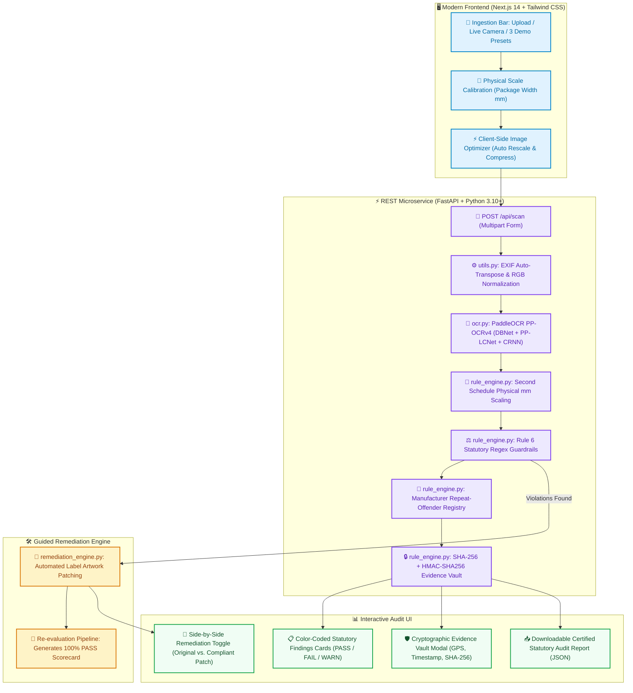

# ⚖️ Legal Metrology Compliance Scanner (LMPC Rule 6 + 2026 Amendments)

[](https://nextjs.org/)
[](https://fastapi.tiangolo.com/)
[-brightgreen.svg)](https://github.com/PaddlePaddle/PaddleOCR)
[](https://www.python.org/)
[](https://www.typescriptlang.org/)
[]()

An automated Computer Vision, deep learning OCR, and statutory legal metrology enforcement system built for **Smart India Hackathon (SIH) 2026**. The platform automates end-to-end inspection, verification, physical font scaling, tamper-proof evidence gathering, and guided artwork remediation for pre-packaged commodities under the **Legal Metrology (Packaged Commodities) Rules, 2011**, amended through **May 2026**.

---

## 📌 Problem Statement & Context

Every pre-packaged commodity manufactured, packed, or sold in India must bear mandatory statutory declarations under **Section 15 of the Legal Metrology Act, 2009** and **Rule 6 of the Legal Metrology (Packaged Commodities) Rules, 2011**. 

Today, compliance checks are caught only through:
1. Manual, labor-intensive market inspections by legal metrology inspectors.
2. Paid manual legal consultant reviews for brand packaging artwork.

This system provides a full-stack, edge-capable, automated verification pipeline that takes packaging photographs (via mobile camera, webcam, or artwork upload), extracts declarations via high-precision OCR, maps them to statutory guardrails, calculates physical font height in millimeters, logs cryptographically signed anti-tampering evidence, and offers automated label remediation.

---

## 🏆 The 5 Core Differentiators

| # | Differentiator | Statutory Legal Basis | Implementation Mechanism |
|---|---|---|---|
| **1** | **Physical Millimeter Font Height Calibration** | **Rule 7 & Second Schedule** (Table I & Table II) | User inputs real-world package width (mm) $\rightarrow$ computes dynamic $mm/px$ ratio $\rightarrow$ validates OCR bounding box numeral/letter heights against 1mm, 2mm, 4mm, and 6mm statutory thresholds. |
| **2** | **Cryptographic Anti-Tampering Evidence Vault** | **Legal Metrology Act Sec 15** & Court Admissibility | Generates an immutable inspection ledger: SHA-256 image fingerprint, UTC ISO timestamp, Inspector ID (`INSP-MH-2026-042`), GPS Geotag (`18.5204° N, 73.8567° E`), and HMAC-SHA256 signature. Produces a verifiable Rule 6 (2022) compliance QR certificate. |
| **3** | **Repeat-Offender Escalation Registry** | **Legal Metrology Act Sec 36(2) & Sec 48** | Manufacturer ID lookup tracks prior violations. First offence triggers standard statutory notice; repeat offenses automatically trigger Section 36(2) compounding warnings (₹50,000 fine + imprisonment escalation). |
| **4** | **2026 E-Commerce Country of Origin Compliance** | **Rule 6(10A)** (Effective 1 July 2026) | Flags imported goods and online marketplace listings lacking search-sortable Country of Origin metadata and clear on-pack origin declarations. |
| **5** | **Guided Remediation ("Fix It For Me")** | Brand Artwork Correction & Pre-Market Approval | While other tools stop at *"here is what is wrong"*, our remediation engine automatically erases non-compliant text regions, redraws declarations at legal millimeter font heights, overlays missing field placeholders, and re-evaluates to a **100% PASS** scorecard with side-by-side Before/After comparison. |

---

## 🏛️ Statutory Declarations Validated (Rule 6 + Amendments)

The regulatory engine strictly enforces clauses mapped in [`guardrails.json`](guardrails.json):

| Statutory Declaration | Gazette Rule Clause | Verification Criteria | Status |
|---|---|---|:---:|
| **Maximum Retail Price (MRP)** | **Rule 6(1)(e)** | Detects currency indicator (`₹`, `Rs.`, `INR`) + price + tax inclusion statement (`inclusive of all taxes`). | **Required** |
| **Net Quantity** | **Rule 6(1)(c) & Rule 12** | Numeric quantity with standard SI units (`g`, `kg`, `ml`, `l`, `pcs`, `units`). Flags non-standard units (`gms`, `kgs`). | **Required** |
| **Manufacturer / Packer Details** | **Rule 6(1)(a) & Rule 10** | Name, street address, city, state, and mandatory **6-digit Postal Index PIN Code**. | **Required** |
| **Date of Manufacture / Packing** | **Rule 6(1)(d)** | Month and year of packing/manufacturing (`MM/YYYY` or text month + year). | **Required** |
| **Best Before / Expiry Date** | **Rule 6(1)(d)** | Expiry date or shelf-life declaration (`Best before X months from packing`). | **Required** |
| **Consumer Care / Grievance Cell** | **Rule 6(2)** | Name, address, telephone/toll-free number (`1800-xxx-xxxx`), and grievance email address. | **Required** |
| **Unit Sale Price (USP)** | **Rule 6(11) (2022 Amendment)** | ₹ per g/ml (for $< 1\text{kg/L}$) or ₹ per kg/L (for $> 1\text{kg/L}$). Numeral height $\ge 50\%$ of MRP font. | **Active** |
| **Deceptive Qualifiers Ban** | **Rule 11(2)** | Flags strictly prohibited misleading terms like `"approx"`, `"when packed"`, or `"minimum"`. | **Active** |
| **Physical Font Sizing (mm)** | **Rule 7 & Second Schedule** | Numeral height $\ge 1\text{mm}, 2\text{mm}, 4\text{mm}, 6\text{mm}$ scaling with Net Qty & PDP area; width $\ge \frac{1}{3}$ height. | **Active** |
| **Sectoral Standards (FSSAI/BIS)** | Food Safety / ISI Acts | 14-digit FSSAI food license number or BIS ISI certification code. | *Optional* |

---

## 🏗️ System Architecture



---

## 🚀 Quickstart Guide

### 1. Prerequisites
- **Python 3.10+** (tested on Python 3.10, 3.11, 3.12, 3.13)
- **Node.js 18+** & `npm`
- **Git**

### 2. Installation

Clone the repository and install dependencies:

```bash
# Clone the repository
git clone https://github.com/UNSTOPBIL/SIH2026-demo.git
cd SIH2026-demo

# Create and activate Python virtual environment
python -m venv .venv

# Windows (PowerShell):
.venv\Scripts\Activate.ps1
# Linux / macOS:
source .venv/bin/activate

# Install Python dependencies
pip install --upgrade pip
pip install -r requirements.txt

# Install Next.js frontend dependencies
cd frontend
npm install
cd ..
```

---

### 3. Launching the System

#### Option A: One-Click Dual Server Launcher (Recommended)

Run the automated orchestrator that boots both FastAPI and Next.js concurrently:

```bash
# Windows:
start_servers.bat

# Or via Python launcher:
python start_servers.py
```

#### Option B: Manual Multi-Terminal Launch

**Terminal 1 — FastAPI Backend (Port 8000):**
```bash
python -m uvicorn api:app --host 127.0.0.1 --port 8000 --reload
```
*Healthcheck:* `http://127.0.0.1:8000/api/health`

**Terminal 2 — Next.js Frontend Dashboard (Port 3000):**
```bash
cd frontend
npm run dev
```
Open your browser at **`http://localhost:3000`**.

#### Option C: Fallback Streamlit Application (Port 8501)
If required for legacy demonstration:
```bash
streamlit run app.py
```

---

## 🧪 Verification & Automated Testing

Run the automated rule engine test suite:

```bash
python -m unittest tests/test_rule_engine.py
```

Expected output:
```text
.........
----------------------------------------------------------------------
Ran 9 tests in 0.016s

OK
```

---

## 📡 REST API Specifications

| Method | Endpoint | Description |
|---|---|---|
| `GET` | `/api/health` | Backend liveness probe and active model status. |
| `GET` | `/api/rules` | Returns active Legal Metrology Rule 6 statutory guardrails from `guardrails.json`. |
| `POST` | `/api/scan` | Accepts `file` (image upload) + `package_width_mm` (float) calibration. Returns compliance scorecard, millimeter font analysis, repeat-offender metadata, and evidence vault cryptographic proofs. |
| `POST` | `/api/remediate` | Generates an automated statutory artwork patch for non-compliant labels, returning patched SVG data and a verified 100% PASS scorecard. |
| `GET` | `/api/vault/export` | Exports an official, cryptographically signed statutory audit certificate in JSON format. |

---

## 📂 Project Repository Structure

```
SIH2026-demo/
├── api.py                     # FastAPI REST microservice backend
├── app.py                     # Streamlit fallback application
├── guardrails.json            # Statutory Rule 6 regex patterns & metadata
├── ocr.py                     # PaddleOCR PP-OCRv4 pipeline with angle correction
├── rule_engine.py             # Rule matching, mm font calibration & evidence vault
├── remediation_engine.py      # Automated label patcher ("Fix It For Me")
├── utils.py                   # Image preprocessing, EXIF transpose & contrast
├── requirements.txt           # Python dependency requirements
├── start_servers.bat          # One-click Windows server orchestrator
├── start_servers.py           # Cross-platform concurrent server runner
├── PROJECT_SPEC.md            # Detailed engineering specification
├── README.md                  # System documentation
│
├── frontend/                  # Next.js 14 + Tailwind CSS Web Application
│   ├── package.json
│   ├── tailwind.config.ts
│   ├── tsconfig.json
│   ├── public/samples/        # Preloaded judge demonstration specimens
│   └── src/
│       ├── app/               # Next.js App Router (layout, page, API proxy)
│       ├── components/        # IngestionBar, StatutoryFindings, EvidenceVaultModal,
│       │                      # RemediationToggle, CameraModal, SpecimenViewer...
│       ├── types/             # TypeScript type definitions (scanner.ts)
│       └── utils/             # Client-side canvas imageOptimizer
│
├── assets/sample_labels/      # Synthetic test packaging labels
├── documents/                 # Reference Legal Metrology Gazette (dataset.pdf)
├── scripts/                   # Utility and testing scripts (adb_watchdog, test_web)
└── tests/
    ├── test_rule_engine.py    # Python unit test suite
    └── test_dom_ui.mjs        # Automated UI/DOM interaction audit suite
```

---

## 👥 Authors & Acknowledgments

- **Smart India Hackathon (SIH) 2026**
- Problem Statement: **SIH25057**
- Reference Legislation: **Ministry of Consumer Affairs, Food & Public Distribution**, Government of India.

